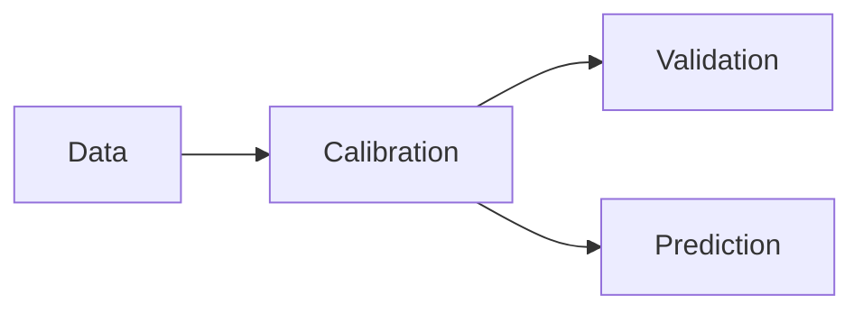

# Problem formulation

- What goes into the model, what comes out?
- Maybe visualize it:

```mermaid
graph LR
Data --> Calibration --> Validation;
Calibration --> Prediction;
```

- delineate area of application

